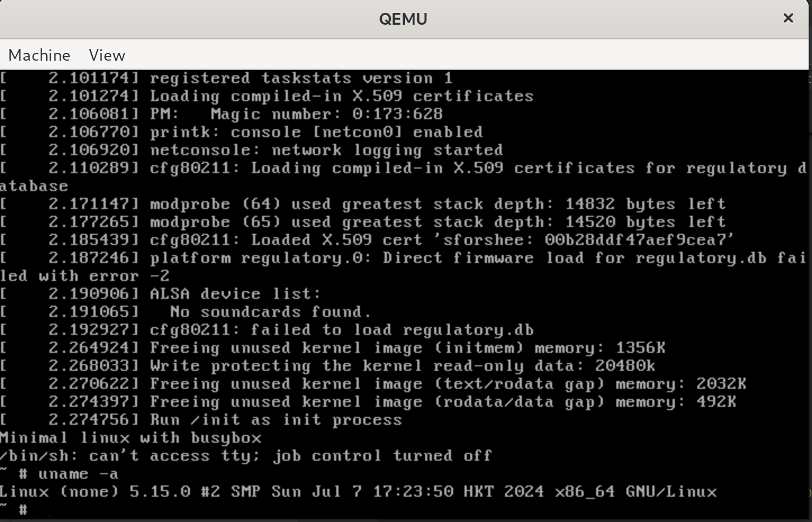
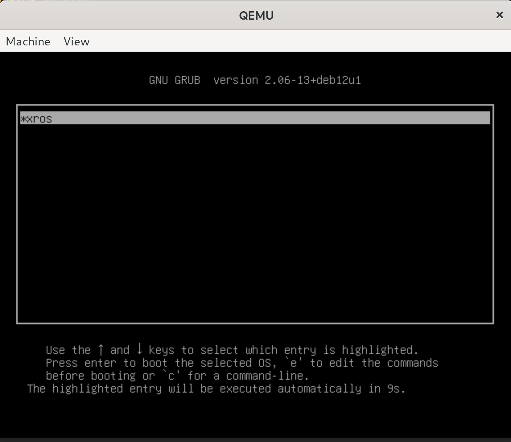
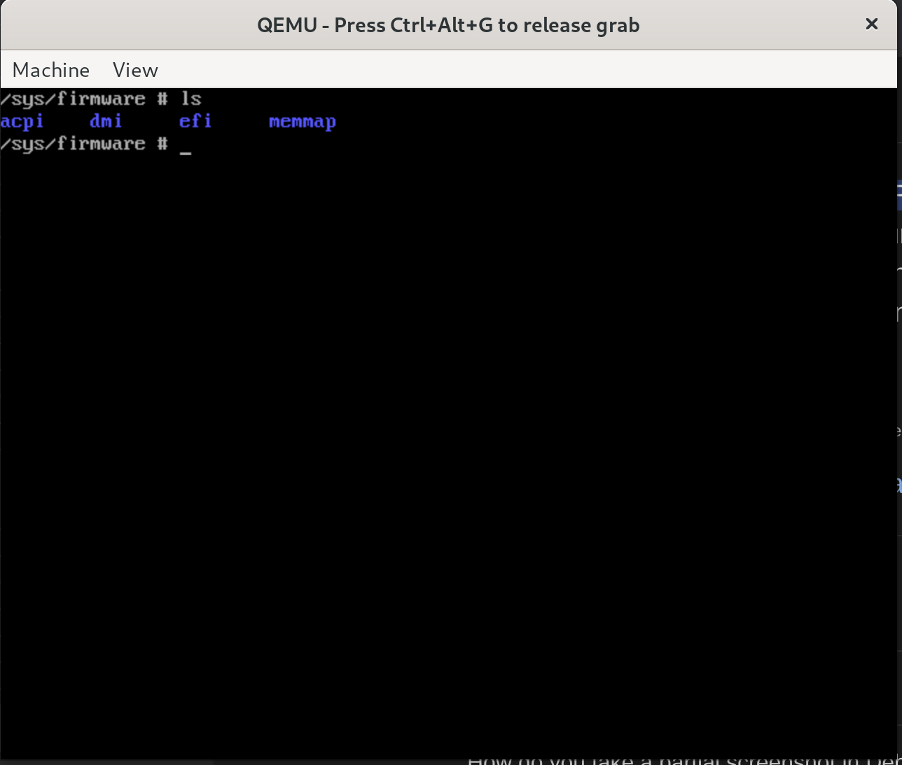

# minimal-Linux-with-busybox
minimal (bootable) Linux with busybox, for both qemu and real machine.

To create a bootable Linux system, a Linux kernel and root filesystem are essential. Therefore, in this guide, we will first build the Linux kernel, then build a statically linked busybox, and finally create a bootable Linux system.

If you want to build a real machine bootable iso, a bootloader is needed. In this guide, we will use grub as our bootloader.

## Before build
You may need to install the required packages first:
```shell
sudo apt install build-essential libncurses-dev bison flex libssl-dev libelf-dev mtools grub-common grub-pc-bin xorriso
```

## Build Linux kernel from source
First, download the Linux kernel source code from [kernel.org](https://kernel.org/) or use GitHub mirror. In this guide, we select version 5.15 as an example.
```shell
wget https://mirrors.edge.kernel.org/pub/linux/kernel/v5.x/linux-5.15.tar.xz
```
Then unzip the xz archive:
```shell
tar -xvf linux-5.15.tar.xz
cd linux-5.15
```
Now you can create a default build config:
```shell
make defconfig
```
We can simply use this default config generated by defconfig, if you want to change config file to enable or disable some features, DO NOT directly edit the .config file, you can use menuconfig to edit it through a TUI.
```shell
make menuconfig
```
Finally we can start to compile the kernel. You can set the max parallel process number by -j flag.
```shell
make -j8 # or use make -j$(nproc) to enable all cores.
```
Older kernels require older versions of gcc, so if you find some compile-time problems, use this command to set the gcc version.
```shell
make HOSTCC=gcc-11 CC=gcc-11 -j8
```
After the build process, you can find the kernel image in the following path:
```shell
arch/x86_64/boot/bzImage # replace x86_64 to your system architecture.
```
You can copy this image file to the project root directory.
```shell
cp arch/x86_64/boot/bzImage ../
```

## Build busybox from source
You can download busybox source code from [busybox.net](https://www.busybox.net/), or download it from **release**.
```shell
wget https://www.busybox.net/downloads/busybox-1.36.1.tar.bz2
```
Then unzip the bz2 archive:
```shell
tar -xvf busybox-1.36.1.tar.bz2
cd busybox-1.36.1
```
Since we need a static-linked binary, we should enable static build by menuconfig TUI and set __Build static binary (no shared libs)__. 
```shell
make defconfig # create default config file first.
make menuconfig
```
Now you can start to compile the busybox.
```shell
make -j8 # or use make -j$(nproc) to enable all cores.
```
After the build process, you can create a Linux-like folder by simple run:
```shell
make install
```
You can find a new folder **_install** is created.

## Create rootfs
Now we can create rootfs based on busybox.
```shell
mkdir -p rootfs # outside busybox dir.
cd rootfs
mkdir -p bin sbin etc usr/bin usr/sbin dev sys proc
```
Copy all contents in **_install** to **rootfs**.
```shell
cp -a ../busybox-1.36.1/_install/* ./
```
Now create an executable file called **init** inside **rootfs** folder. In this guide, **init** is a shell script, but you can also use any executable as the **init** file.
```shell
vim init
```

```shell
#!/bin/sh

mount -t devtmpfs devtmpfs /dev
mount -t proc none /proc
mount -t sysfs none /sys

dmesg -n 1

echo "Minimal linux with busybox"
exec /bin/sh

poweroff -f
```
And then:
```shell
chmod +x init
```
Create rootfs image:
```shell
find . -print0 | cpio --null -ov --format=newc | gzip -9 > ../rootfs.img
```

## Testing with qemu
Here is an example folder hierarchy.
```shell
.
├── busybox-1.36.1
├── busybox-1.36.1.tar.bz2
├── bzImage
├── linux-5.15
├── linux-5.15.tar.xz
├── rootfs
└── rootfs.img
```
Start qemu with this command:
```shell
qemu-system-x86_64 -kernel bzImage -initrd rootfs.img
```

## Build bootable ISO image
First setup iso folder:
```shell
mkdir -p xriso # you can use any name you like.
mkdir -p xriso/boot
mkdir -p xriso/boot/grub
cp bzImage rootfs.img xriso/boot/
```
Then create **grub.cfg** file inside grub folder:
```shell
cd xriso/boot/grub
vim grub.cfg
```

```shell
set default=0
set timeout=10
menuentry 'xros' --class os {
    insmod gzio
    insmod part_msdos
    linux /boot/bzImage vga=0x33E
    initrd /boot/rootfs.img
}
```
Now you can create ISO (in the project root directory):
```shell
grub-mkrescue -o xros.iso xriso/
```
The **xros.iso** is bootable ISO, so we can directly boot our Linux system from it on both qemu and real machine. You can test it on qemu first:
```shell
qemu-system-x86_64 -cdrom xros.iso
```
And you can see the grub boot page, and select xros to boot our Linux system.


## Boot on real machine!
Now you can boot your own Linux system on your real machine. Since this ISO image is set for bios booting, so make sure your real machine works on bios or csm enable mode. If you want to use UEFI booting, see the next section.

## UEFI support
Previously built system only supports booting on bios, but today's mainstream devices use UEFI to boot. So if you want this system to support UEFI, follow the guide below to change some configuration files and rebuild the system.

First, enable kernel UEFI graphics support:

```shell
make menuconfig
```
In menuconfig TUI, enable the following features.
```shell
Device Drivers  --->
  Graphics support  --->
    Frame buffer Devices  --->
      <*> Support for frame buffer devices
      <*> EFI-based Framebuffer Support
```
Then rebuild the kernel.

Second, replace the original **grub.conf** file with the following:
```shell
set default=0
set timeout=10

insmod efi_gop
insmod font
if loadfont /boot/grub/fonts/unicode.pf2
then
        insmod gfxterm
        set gfxmode=640x480
        set gfxpayload=keep
        terminal_output gfxterm
fi
menuentry 'xros' --class os {
    insmod gzio
    insmod part_msdos
    linux /boot/bzImage vga=0x33E
    initrd /boot/rootfs.img
}
```
Then re-build bootable ISO.

To test the UEFI enable ISO, you can use qemu:
```shell
sudo qemu-system-x86_64 -cdrom xros.iso -drive if=pflash,format=raw,readonly,file=/usr/share/OVMF/OVMF_CODE.fd -drive if=pflash,format=raw,file=/usr/share/OVMF/OVMF_VARS.fd -m 2048 -cpu host -enable-kvm
```
You can find **efi** folder inside path **/sys/firmware/**.


UEFI version on real machine:

